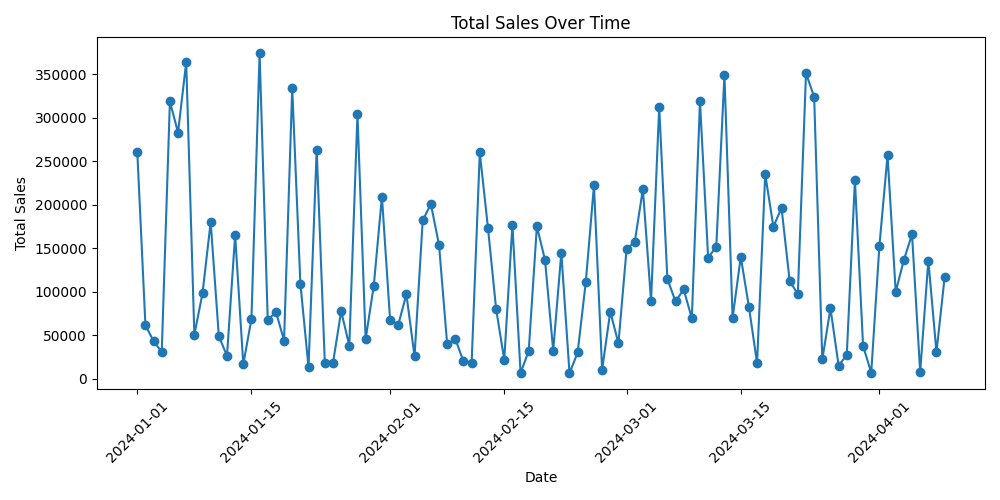

# Week 5 – Sales Data Analysis

## Project Overview
This project performs data analysis on a sales dataset using Python and Pandas.
The goal is to analyze sales performance and visualize important insights.

## Dataset
- File: sales_data.csv
- Columns: Date, Product, Quantity, Price

## Analysis Performed
- Loaded and explored dataset
- Checked missing values
- Created total sales column
- Calculated total revenue
- Analyzed sales by product
- Analyzed monthly sales trends

## Visualizations
### 1. Sales by Category (Bar Chart)

### 2. Sales Trend Over Time (Line Chart)

## Tools Used
- Python
- Pandas
- Matplotlib

## Outcome
The analysis helped identify top-selling products and sales trends over time.
